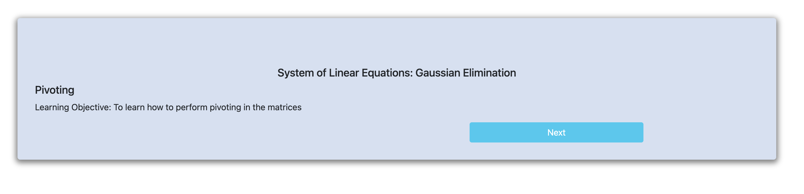
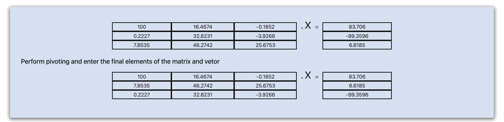
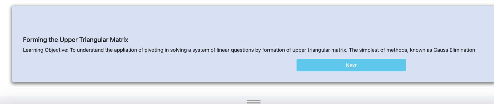
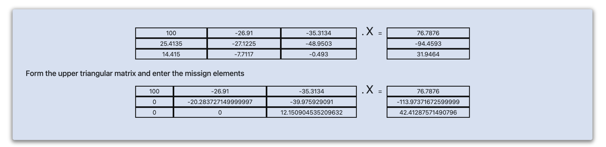
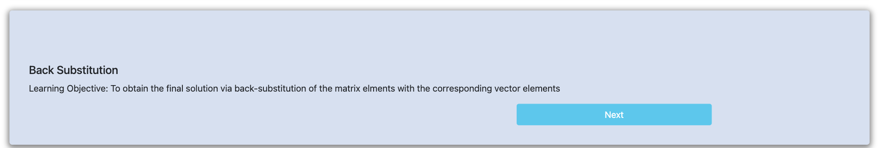
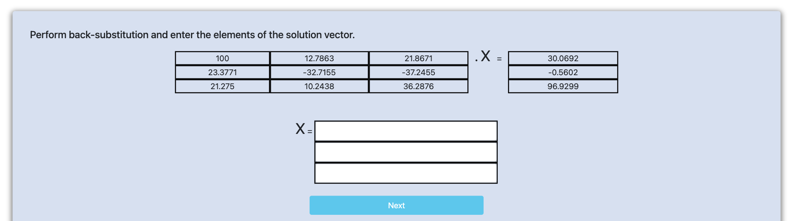

<h3>Step I:    Click on “Next”.</h3>

    

<h3>Step II: Perform pivoting and enter the final elements of the matrix and vector.</h3>
Then click on <b>“Next”.</b>

    

<h3>Step III:</h3>
Then click on <b>“Next”.</b>

    

<h3>Step IV:</h3>

    

<h3>Step V:</h3>
Then click on <b>“Next”.</b>

    

<h3>Step VI:</h3>

    

